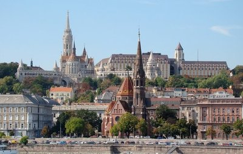
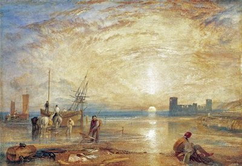
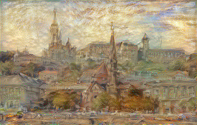

This course provides a practical introduction to the field of Machine Learning and one of its subfield, Deep Learning, a representation learning method, that has become the most dominant approach for many machine learning tasks in the past years.

It has been successfully applied to problems in computer vision (image classification, object detection, semantic segmentation, self-driving cars) and sequence modeling (natural language processing, speech recognition, image caption generation, machine translation) where the input data is unstructured and typically have a large volume. It also has applications in drug discovery, bioinformatics, medical image analysis and diagnosis, image restoration, and many other fields.

This course requires at least an intermediate Python knowledge: be confident with the syntax and programming concepts and have experience in using the Python scientific libraries, particularly NumPy. Check the links below for tutorials. We will use the Tensorflow/Keras deep learning framework (Tensorflow 2.2) for the coursework.

## Links and Bibliography

### Programming

1. [freeCodeCamp.org - Learn Python - Full Course for Beginners](
https://www.youtube.com/watch?v=rfscVS0vtbw)
2. [freeCodeCamp.org - Intermediate Python Programming Course](
https://www.youtube.com/watch?v=HGOBQPFzWKo)
3. [Python course](https://www.python-course.eu/)
4. [Python and numpy tutorial](
https://github.com/kuleshov/teaching-material/blob/master/tutorials/python/cs228-python-tutorial.ipynb)
5. [Python Specialization - Coursera](
https://www.coursera.org/specializations/python) (University of Michigan)
6.  Wes McKinney - Python for Data Analysis, particularly Chapters 5. and 12.
7. Mark Lutz - Learning Python

### Machine Learning / Deep Learning

1. Aurélien Géron - Hands-On Machine Learning with Scikit-Learn and Tensorflow
2. Francois Chollet - Deep Learning with Python
3. Gareth James, Daniela Witten, Trevor Hastie, Robert Tibshirani - An Introduction to Statistical Learning
4. Trevor Hastie, Robert Tibshirani, Jerome Friedman - The Elements of Statistical Learning
5. Christopher M. Bishop - Neural Networks for Pattern Recognition
6. Christopher M. Bishop - Pattern Recognition and Machine Learning
7. Josh Patterson, Adam Gibson - Deep Learning
8. Ian Goodfellow, Yoshua Bengio, Aaaron Courville - Deep Learning

___

Given a content image and a style reference image

 &nbsp; 

we can blend them together so the output image looks like the content image, but "painted" in the style of the  reference image.

